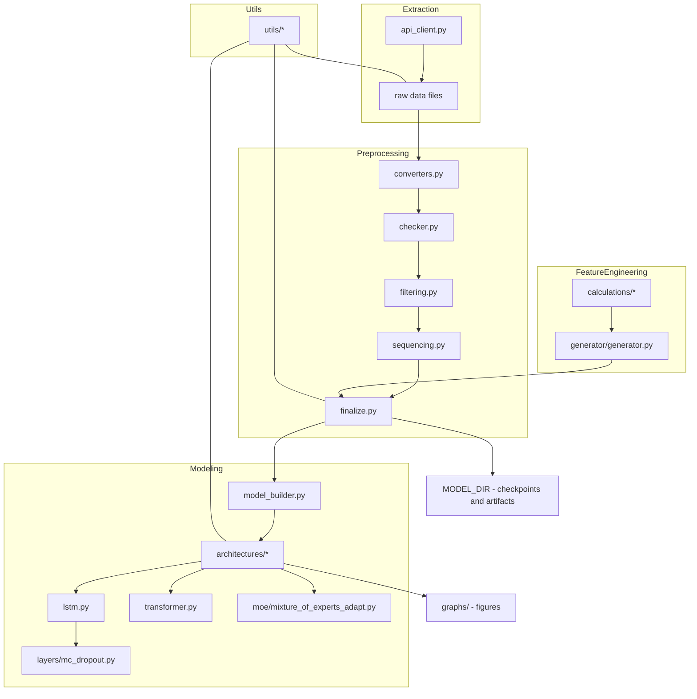

# Stock Return Preditcion using MoE with Uncertainty Quantification

[](link)
[](link)
[](LICENSE)

## Table of Contents

- [Overview](#overview)
- [Key Features (detailed)](#key-features-detailed)
- [Architecture Overview](#architecture-overview)
  - [Mermaid architecture diagram](#mermaid-architecture-diagram)
- [Technical Design Details](#technical-design-details)
  - [Data extraction & input formats](#data-extraction--input-formats)
  - [Preprocessing & sequencing pipeline](#preprocessing--sequencing-pipeline)
  - [Feature engineering internals](#feature-engineering-internals)
  - [Modeling: architectures, training, inference](#modeling-architectures-training-inference)
  - [Evaluation & visualization](#evaluation--visualization)
- [Performance Considerations](#performance-considerations)
- [Limitations & Assumptions](#limitations--assumptions)
- [Installation & Reproducible Environment](#installation--reproducible-environment)
- [Usage Examples (CLI / code snippets)](#usage-examples-cli--code-snippets)
- [Configuration](#configuration)
- [Contributing](#contributing)
- [License](#license)
- [Appendix / TODOs](#appendix--todos)

## Overview

This repository contains a modular pipeline for stock return prediction research. It covers raw data extraction from APIs, preprocessing and sequencing time-series data, a rich set of financial feature-engineering utilities (momentum, liquidity, valuation and risk measures), and several model architectures and training utilities (LSTM, Transformer, Mixture-of-Experts, and MC Dropout layers). The codebase is structured to encourage experimentation: swap feature generators, change model architectures, or plug in new data sources with minimal changes.

## Key Features (detailed)

Each feature description below includes what it does, how it works (implementation notes), and why it matters.

- Data extraction (src/data_extraction)
  - What: Provides API client and extraction scripts to download stock price series, volume, market caps, and macroeconomic indicators.
  - How: The `api_client.py` encapsulates HTTP calls and response normalization. `main.py` orchestrates scheduled extraction tasks and writes raw output to disk using `src/utils/disk_io.py`.
  - Why: Reliable, normalized raw data is the foundation for reproducible experiments and avoids ad-hoc scraping logic in downstream code.

- Preprocessing pipeline (src/data_preprocessing)
  - What: A set of modules for validating, cleaning, converting, filtering, generating sequences, and finalizing datasets used for training and evaluation.
  - How: Contains specialized scripts:
    - `checker.py` validates dataset integrity (missingness, date continuity).
    - `converters.py` handles unit conversions and aligns periodicities (daily → monthly/weekly aggregation).
    - `filtering.py` contains stock-level and dataset-level filters (e.g., minimum liquidity, exchange inclusion).
    - `sequencing.py` constructs fixed-length rolling windows (timestep sequences) for model input and aligns labels with prediction horizons.
    - `finalize.py` composes feature matrices and splits datasets into train/val/test folds.
  - Why: Ensures a reproducible, auditable path from raw data to model-ready tensors and separates data hygiene from modeling logic.

- Feature engineering (src/feature_engineering)
  - What: Implements financial features used in empirical asset pricing (momentum, momentum variants, liquidity measures, volatility, betas, valuation ratios).
  - How: The folder contains `calculations/` with focused implementations (e.g., `momentum.py`, `liquidity.py`, `ratios.py`, `risk.py`) and a `generator/generator.py` that composes features into a single pipeline.
  - Why: Good features capture domain knowledge and significantly improve model signal-to-noise ratio. The modular implementation lets you add/benchmark features easily.

- Modeling (src/modeling)
  - What: Model architectures and training utilities, including LSTM, Transformer, simple dense networks, MC Dropout layer, and a Mixture-of-Experts adaptation.
  - How: Implementations are split across `architectures/` (model definitions), `layers/` (custom layers like `mc_dropout.py`), and `moe/` (mixture-of-experts implementations). `model_builder.py` provides factory/helper functions to instantiate models.
  - Why: Enables quick experiments with different sequence models and uncertainty estimation (MC Dropout) and supports ensemble/expert approaches (MOE) to capture heterogenous stock behaviors.

- Utilities and visualization (src/utils and graphs/)
  - What: Helper utilities for metrics, plotting, I/O, and small experiment orchestration.
  - How: `disk_io.py` centralizes save/load semantics (CSV/Parquet/npz), `metrics.py` implements evaluation metrics, and `plotter.py` and `modeling/utils/visualization.py` create baseline figures saved under `graphs/`.
  - Why: Reusable utilities reduce duplicated code, provide consistent experiment outputs, and speed up analysis.

## Architecture Overview

This section explains the high-level architecture, dataflow, responsibilities of main modules, and design patterns used.

High-level dataflow

1. Extraction: `src/data_extraction` collects raw time-series and macro data and writes them to `DATA_DIR/raw/`.
2. Preprocessing: `src/data_preprocessing` reads raw files, validates them, converts frequencies, filters stocks, generates feature columns, and sequences the data into model-ready arrays. Intermediate artifacts are saved under `DATA_DIR/processed/`.
3. Feature engineering: `src/feature_engineering` functions are invoked (from preprocessing or a separate step) to compute domain features per firm-time step. Results are merged into the processed dataset.
4. Modeling: `src/modeling` loads processed datasets, constructs model architectures, and trains models. Trained models and logs are persisted in `MODEL_DIR` and `graphs/`.
5. Evaluation: Predictions are evaluated using `src/utils/metrics.py` and visualized.

Roles and responsibilities (key files)

- `src/data_extraction/api_client.py`
  - Role: Provides a thin wrapper for external API calls and handles rate-limiting, retries, and normalization of responses to canonical DataFrame formats. Functions typically return pandas DataFrames keyed by date and ticker.

- `src/data_extraction/main.py`
  - Role: CLI/entry-point for scheduled extraction jobs. Calls the `api_client` and writes raw outputs using `src/utils/disk_io`.

- `src/data_preprocessing/converters.py`
  - Role: Aggregation utilities (daily → monthly), alignment of timestamps, and conversion of raw financial statement formats into numeric tables.

- `src/data_preprocessing/sequencing.py`
  - Role: Build rolling windows / sequences of fixed length. Core helper creates 3D arrays: [batch, timesteps, features]. The README appendix includes the expected nested list/array structure used by training loops.

- `src/feature_engineering/calculations/momentum.py` (and other calculators)
  - Role: Implement momentum measures (1-, 12-, 36-month mom, chmom, indmom), max daily returns, sector-adjusted momentum. Functions expect time-indexed price arrays and return aligned series.

- `src/modeling/architectures/lstm.py`
  - Role: Defines an LSTM-based Keras/PyTorch model for sequence regression/classification. (TODO: check exact framework — both TF and PyTorch are acceptable; inspect code to confirm.)

- `src/modeling/architectures/transformer.py`
  - Role: Transformer-style sequence model for longer-range dependencies.

- `src/modeling/architectures/nn.py` and `model_builder.py`
  - Role: Lightweight dense models and factory functions to instantiate different architectures with standardized input shapes and output heads.

- `src/modeling/layers/mc_dropout.py`
  - Role: Specialized dropout layer that stays active at inference time to provide Monte Carlo uncertainty estimates.

- `src/modeling/moe/mixture_of_experts_adapt.py`
  - Role: Implements mixture-of-experts logic to combine specialist submodels; likely includes gating networks and expert routing.

Design patterns and engineering decisions

- Modular pipeline: The project follows a pipeline pattern that separates extraction, transformation, and modeling. This enables re-running individual steps and better unit testing.
- Factory / builder pattern: `model_builder.py` centralizes model creation to allow consistent hyperparameter wiring across experiments.
- Single responsibility: Each module provides one logical responsibility: calculators only compute features, converters only transform frequency/units, and modeling modules only define networks and layers.
- Persist intermediate artifacts: The codebase favors writing processed data to disk (Parquet/CSV) for reproducibility and to avoid expensive recomputation.

### Mermaid architecture diagram



## Technical Design Details

This section explains the main algorithms and workflows implemented in the codebase.

### Data extraction & input formats

- Raw extraction outputs are stored per-source and per-ticker as tabular files (CSV/Parquet). Each time-series file uses an index or column named `date` and a `ticker` identifier where applicable.
- The API client normalizes response payloads to pandas DataFrames with consistent column names: `open`, `high`, `low`, `close`, `volume`, `market_cap` (when available).

### Preprocessing & sequencing pipeline

Key steps:

1. Validation: `checker.py` ensures date ranges are consistent and flags missing days or unexpectedly sparse series. It raises or logs warnings based on thresholds.
2. Frequency conversion: `converters.py` provides functions to create monthly and weekly aggregations from daily EOD data. Typical operations:
   - monthly close: last trading day's `close` per month
   - monthly volume: sum of `volume`
   - dollar volume: average price × volume aggregation
3. Filters: `filtering.py` removes stocks that fail liquidity thresholds or have insufficient history. Filters are typically parameterized in `src/config/settings.py`.
4. Feature computation: The `feature_engineering` calculators are called to attach engineered features to each (ticker, date) row.
5. Sequencing: `sequencing.py` produces training windows: for a chosen `window_size` (e.g., 12 months) it creates sequences X of shape [N, window_size, F] and labels y of shape [N, 1] corresponding to forward return or classification bins.

Label alignment: Labels are aligned carefully to avoid lookahead bias. For example, to predict next-month return, the label for a sequence ending at month t uses returns computed from t+1.

Edge-case handling: The pipeline drops sequences with missing values beyond a configurable threshold, and optionally fills short gaps with forward/backward fill or interpolation as configured.

### Feature engineering internals

Major feature groups (implemented in `src/feature_engineering/calculations`):

- Momentum measures
  - Implementation: rolling returns over several horizons (1m, 12m, 36m), change-in-momentum (chmom), and industry-adjusted momentum (indmom). Functions operate on monthly aggregated returns and use vectorized pandas/numpy operations.
  - Importance: Momentum is a persistent cross-sectional predictor in equity returns research.

- Liquidity measures
  - Implementation: dollar-volume (`dolvol`), turnover (`turn`), zero-trading days (`zerotrade`) and log market value (`mve`). Aggregations and rolling statistics are implemented with groupby-rolling semantics.
  - Importance: Liquidity is correlated with return expectations and helps filter microcaps and illiquid stocks.

- Risk measures
  - Implementation: idiosyncratic volatility (idiovol) computed as residual STD from regressions on market returns over rolling windows; beta and beta-squared computed with rolling OLS on weekly returns.
  - Importance: Controls for risk exposures and enables risk-adjusted modeling.

- Valuation & fundamentals
  - Implementation: price-to-earnings-like signals (`ep_sp`), earnings growth (`agr`), with functions handling annual and quarterly inputs.

Vectorization & batching: Calculations are written to operate on pandas Series/DataFrame columns and accept both single-ticker series and batched DataFrames. The generator composes feature columns into a final wide table.


### Modeling: architectures, training, inference

Model construction

- `model_builder.py` exposes a small API to create models with a consistent signature. Typical inputs:
  - `input_shape` (timesteps, features)
  - `output_dim` (1 for regression or number of classes)
  - `hparams` (dropout, hidden sizes, learning rate)

Training loops

- The repo includes lightweight training scaffolds (TODO: exact training loop entrypoint). Training loops:
  - Load dataset artifacts (`npz` / `npy` or memory-mapped arrays).
  - Create data loaders / iterators that yield batches of X, y.
  - Configure optimizer, loss (e.g., MSE for regression; cross-entropy for classification), and a scheduler (TODO: confirm exact scheduler implementation).
  - Run epochs with per-epoch validation evaluation and early stopping criteria.

Loss functions & optimization

- Default losses are standard regression/classification losses. The codebase supports uncertainty-aware predictions using MC Dropout: run multiple stochastic forward passes at inference (keeping dropout active) and aggregate mean and variance.

Inference

- For point predictions, models support a `predict(X)` API that returns forecasted returns.
- For uncertainty estimates, `mc_dropout` layer is used at inference-time with multiple stochastic passes.

Ensembling / MoE

- Mixture-of-Experts implementation provides a gating network routing inputs to specialist experts. This is useful for handling heterogenous cross-sectional behavior (e.g., sector-specific dynamics).

### Evaluation & visualization

- Evaluation metrics live in `src/utils/metrics.py` and include standard MSE/RMSE and custom finance metrics (e.g., information coefficient, rank correlation, decile portfolio returns).
- Visualization functions can plot distributions, correlation matrices, feature importance, and sample prediction-vs-actual charts saved to `graphs/`.

## Performance Considerations

- Data persistence: Intermediate artifacts are saved to disk (Parquet/npz) to avoid re-computation, especially for expensive feature calculations.
- Vectorized calculations: Feature calculators use pandas/numpy vectorized ops and groupby-rolling semantics to avoid Python-level loops.
- Batch-friendly design: `sequencing.py` produces contiguous arrays ready for fast batch ingestion into frameworks (TF/PyTorch).
- IO choices: Prefer Parquet for large tabular artifacts to reduce IO overhead and memory usage.
- Parallelization: TODO: if needed, add optional multiprocessing or Dask support for feature computation across tickers.

Practical tips

- When computing rolling regressions (idiovol, beta) prefer windowed matrix operations or incremental OLS to reduce recomputation.
- Use memory-mapped numpy arrays for very large datasets to avoid memory blow-ups.

## Limitations & Assumptions

- Data source assumptions: The pipeline assumes external APIs provide consistent daily EOD data with standard columns; mismatches require connector updates.
- Missing values: The pipeline currently drops or fills missing values according to simple heuristics; more advanced imputation is optional.
- Timezones and trading calendars: Code assumes a single trading calendar; multi-market or cross-listing requires calendar-aware alignment.
- Framework agnostic: The modeling code may assume Keras or PyTorch in different files — confirm the chosen framework in the codebase before running training (TODO).

## Installation & Reproducible Environment (Docker)

These instructions create a fully reproducible Python environment using Docker. No local Python installation or virtual environment is required.

---

### 1. Clone repository

```powershell
git clone https://github.com/AdamAdham/Stock-Return-Prediction.git
cd Stock-Return-Prediction
```

---

### 2. Build Docker image

This will create a container image with TensorFlow GPU (or CPU) and all dependencies.

```powershell
docker build -t stock-predictor .
```

- `stock-predictor` is the name of the Docker image
    
- Make sure your `Dockerfile` and `requirements.txt` are in the repo root
    

---

### 3. Run a specific Python file inside the container

You can run any script in the container without entering it:

```powershell
docker run --rm -it -v ${PWD}:/workspace stock-predictor python train.py
```

- `--rm` → automatically removes the container after it exits
    
- `-it` → interactive terminal
    
- `-v ${PWD}:/workspace` → mounts your local project folder into the container
    
- `python train.py` → runs your specific Python file
    

You can replace `train.py` with any other file in your repo.

---

### 4. Enter the container interactively

To explore the container, run:

```powershell
docker run --rm -it -v ${PWD}:/workspace stock-predictor bash
```

Then, inside the container:

```bash
# List files
ls

# Run any Python script
python train.py
python src/evaluate.py

# Start Jupyter
jupyter lab --ip=0.0.0.0 --no-browser --allow-root
```

- All changes to files in `/workspace` will reflect in your local project directory.

## Contributing

Guidelines for contributors:

1. Fork -> branch (feature/ or fix/ prefix) -> implement → tests → PR.
2. Write unit tests covering new features (place in `tests/`). Aim for deterministic tests by using small synthetic datasets.
3. Keep data extraction logic side-effect free where possible; prefer returning DataFrames from functions and centralizing writes in `disk_io.py`.
4. Document assumptions and add docstrings for complex functions, especially those that implement rolling regressions or causal label alignment.

Code style

- Follow PEP8 for Python. Use `black` and `flake8` for automated formatting and linting.


Developer tips

- Use the modular structure: extend `src/feature_engineering/generator` to add new engineered features.
- Add new model definitions in `src/modeling/architectures` and register them in `model_builder.py`.
- Keep data extraction idempotent: make raw data downloads reproducible and safe to re-run.

